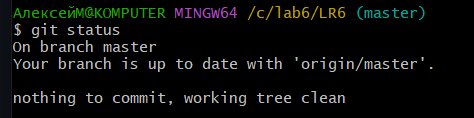

## Лабораторная работа №6

## Цель работы:
Изучить базовые возможности системы управления версиями, получить опыт работы с Git Api, опыт работы с локальным и удаленным репозиторием. 

## Порядок выполнения работы:

1. Создать аккаунт на сайте GitHub. 
2. Сделать копию в личное хранилище из https://github.com/Kurtyanik/LR6/ (Fork). 
3. Установить Git (https://git-scm.com/). 
4. После установки настроить клиент git, введя имя пользователя (Группа Фамилия И.О.) и email. 
5. Клонировать свой личный удалённый репозиторий на компьютер. 
6. Добавить файл через интерфейс GitHub. Подтянуть изменения в локальный репозиторий. 
Работу продолжать локально.  
7. Получить историю операций для каждой из веток. 
8. Просмотреть последние изменения. 
9. Выполнить слияние в ветку master, разрешив конфликт (можно использовать специальные редакторы или графический интерфейс git). 
10. Удалить побочную ветку после успешного слияния. 
11. Сделать изменения и зафиксировать их, оставляя комментарии, несколько раз. 
12. Сделать откат коммита. 
13. Создать ветку для отчёта. 
14. Начать оформлять отчёт в файле README.md (разрешены сторонние редакторы с подсветкой синтаксиса), используя markdown синтаксис (https://guides.github.com/features/mastering-markdown/):  

- В отчёте должен быть снимки экрана консоли и сторонних программ. Файлы снимков экрана разместить в отдельной папке. 
- Лог команд (без результатов их выполнения). 
    
При написании отчёта периодически делать коммиты, не забывать комментировать. 

15. Получить историю операций в форматированном виде (сокращённый хэш + дата + имя автора + комментарий). Добавить её в отчёт и сделать финальную фиксацию изменений. 
16. Отправить локальные изменения в сетевое хранилище GitHub (если делаете работу постепенно, то синхронизацию проводить в конце рабочего сеанса)

## Описание выполнения работы:
1. Fork из репозитория лабораторной работы был склонирован на компьютер.
 Настройки git:

    ``` sh
    git config --list 
    ```   
     

    Клонирование репозитория:

    ``` sh
    git clone SSH 
    ```
    
    

3. В репозиторий был добавлен файл через интерфейс GitHub.
   
    

   Изменения были подтянуты в локальный репозиторий. 

   ``` sh
    git pull 
    ```

    


4. Была получена история операций для каждой из веток. 
   
    Для ветки master:

    ```sh
    git log
    ```

    

    Для ветки branch1:

    ```sh
    git log origin/branch1
    ```

    


5. Были получены последние изменения. 

    ```sh
    git status
    ```
   
   


6. Было выполнено слияние в ветку master с разрешением конфликта.

    Слияние веток:

    ```sh
    git merge origin/branch1
    ```

    Конфликт:
   
    

    Содержимое mergefile.txt после разрешения конфликта:
    
    

    Коммит с разрешением конфликта:

    ```sh
    git add mergefile.txt
    git commit -m "Конфликт разрешен"
    ```

    
    
    

    

    Удаление побочной ветки:

    ```sh
    git push origin -d branch1
    ```

    

    Осталась одна ветка - master.

    

7. Изменения в файле `777.txt`, которые фиксировались коммитами.

    Первое изменение:

    

    Второе изменение:

    

    До отката:

    

    Откат коммита:

    ```sh
    git reset --hard HEAD~
    ```
    
    
    
    После отката:

    

8. Была создана ветка для отчета.

    ```sh
    git checkout -b report
    ```
    

    Был загружен незаконченный отчет.

    

9. Была получена история операций в форматированном виде (сокращённый хэш + дата + имя автора + комментарий). 

    ```sh
    git log --pretty=format:"%h %cd - %an : %s"
    ```
    
    

## Вывод:
В ходе этой работы были изучены базовые возможности системы управления версиями, получен опыт работы с Git Api, опыт работы с локальным и удаленным репозиторием.
